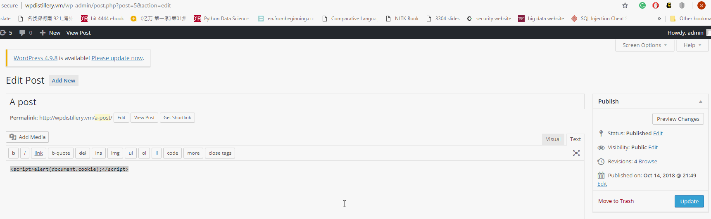
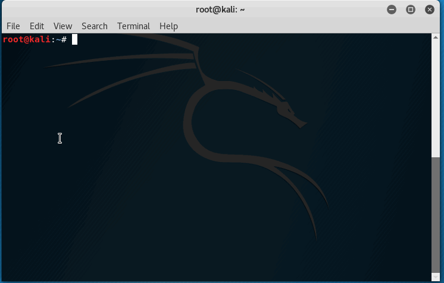

# Week7

Wordpress version: 4.2

1. User Enumeration Attack

Wordpress showed "Invalid username" when a wrong username was entered, but it showed "The password you entered for the username admin is incorrect" which indicates admin is the corret username to hack.

To recreate: the default username and password are both admin, entering admin123 in username and something in password will give you "Invalid username" error; entering admin in username and 123 for password will give you "The password is incorrect" error.

2. XSS Attack

Cookie associated with the current document can be easily hacked by inserting script on a post.

To recreate: type  in your post

3. Enumerate username and password

Username and password are easy to find using wpscan. As shown below, the default username is shown as admin, and its password is also admin.

To recreate: type "wpscan -u 192.168.33.10 -e u vp" on Kali terminal

